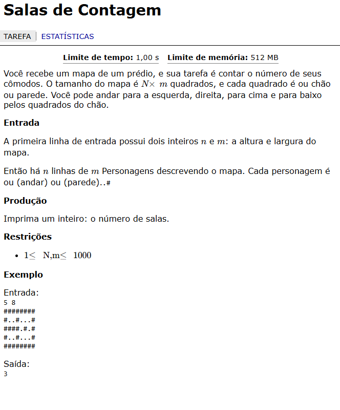
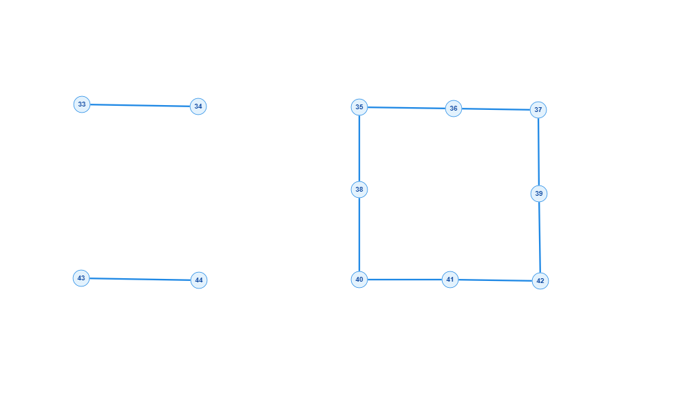
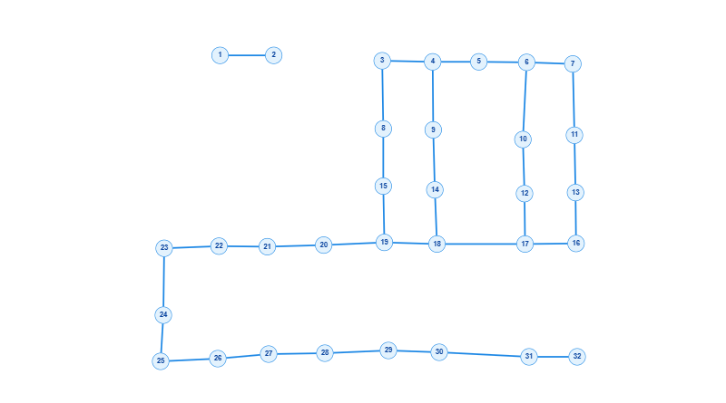
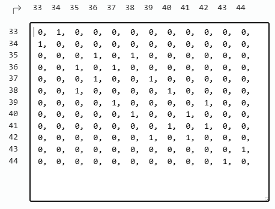

# Resolução de Problemas com Grafos — Trabalho 1

## 1. Questão

O problema apresenta um mapa de um prédio representado por uma matriz de dimensão `N × M`.



A entrada fornece as dimensões da matriz e, em seguida, o mapa, onde cada posição representa chão ou parede.

A saída esperada é um inteiro representando a **quantidade de cômodos existentes no mapa**.

---

## 2. Interpretação e Modelagem

Para transformar o problema em um grafo, interpretamos:

* `.` → representa um espaço de chão e, portanto, um **vértice**.
* `#` → representa uma parede e não é considerado um vértice.
* **Aresta** → representa a possibilidade de andar entre dois espaços de chão adjacentes, podendo se movimentar para cima, baixo, esquerda ou direita.

Dessa forma, os espaços de chão conectados entre si formam um **subgrafo**.

Cada subgrafo conectado representa um **cômodo**.

---

## 3. Representação como Grafo

A partir da interpretação do mapa, foi construída a seguinte representação:



Na representação existem **3 subgrafos**, ou seja, **3 grupos de vértices que não possuem conexão entre si**.

Portanto:

* **Quantidade de subgrafos:** 3
* **Quantidade de cômodos:** 3
* **Saída esperada:** `3`

---

## 4. Nova Entrada

Nesta etapa será adicionada uma nova entrada para representar outro mapa como grafo e verificar uma nova saída.

### Entrada

```text
7 10
##########
#..#.....#
#..#..#..#
####..#..#
#........#
#.########
#........#
```

### Saída Esperada

```text
2
```

## Representação com Grafo 
 


* **Quantidade de subgrafos:** 2
* **Quantidade de cômodos:** 2
* **Saída esperada:** `2`

---

## 5. Matriz de Adjacência do Grafo Problema 1

Aqui iremos mostrar a Matriz de Adjacência que constitui em uma matriz quadrada que os vértices compõe cada linha e cada coluna, e cada posição Xij representa a conexão/ligação dos respectivos vértices 



---

## 6. Lista de Adjacência do Grafo Problema 1

Aqui iremos mostrar a Lista de Adjacência que constitui em uma lista que cada posição é um vértice do grafo , e em cada posição tem outra lista com todos os outros vértices que fazem conexão diretamente com ele


