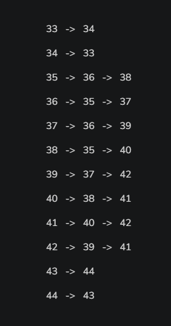

# Marco 2 — Representações do Grafo e Medidas Estruturais

## 1. Matriz de Adjacência do Grafo Problema 1

A **matriz de adjacência** é uma matriz quadrada em que as linhas e as colunas representam os vértices do grafo. Cada posição `M[i][j]` indica se existe uma conexão entre os vértices `i` e `j`.

### Vantagem

* A matriz de adjacência facilita a verificação de uma conexão entre dois vértices, pois basta consultar diretamente a posição `M[i][j]`.

### Desvantagem

* Para este problema, a matriz de adjacência não é uma representação eficiente, pois possui um alto consumo de memória. A maioria das posições da matriz teria valor `0`, já que cada vértice possui no máximo quatro vizinhos.

---

## 2. Lista de Adjacência do Grafo Problema 1

A **lista de adjacência** consiste em uma estrutura em que cada posição representa um vértice do grafo e, associada a ela, existe uma lista contendo todos os vértices que possuem conexão direta com ele.

### Vantagem

* A lista de adjacência é mais viável para este problema, pois armazena apenas os vizinhos que possuem conexão direta com cada vértice. Como os movimentos possíveis são para cima, baixo, esquerda e direita, cada vértice possui no máximo quatro vizinhos.

### Desvantagem

* Para verificar se dois vértices possuem uma conexão, é necessário percorrer a lista de adjacência do vértice até encontrar o vértice desejado.

---

## 3. Representação Implícita do Grafo Problema 1

A **representação implícita** é a mais adequada para este problema, pois não é necessário armazenar explicitamente as arestas do grafo.

O próprio mapa permite identificar os vértices e suas conexões. Cada `.` representa um vértice, correspondente a um espaço de chão. Para verificar se existe uma conexão, basta observar as posições imediatamente acima, abaixo, à esquerda e à direita.

Se uma dessas posições também possuir `.`, significa que existe uma conexão entre os dois espaços.

Dessa forma, o próprio mapa contém as informações necessárias para determinar a conectividade do grafo, sem a necessidade de armazenar uma matriz ou uma lista de todas as arestas.

---

## 4. Medidas Estruturais Pertinentes

Para o grafo apresentado, temos:

* **Ordem:** 12
* **Tamanho:** 22

A **ordem** corresponde à quantidade de vértices presentes no grafo.

O **tamanho** corresponde à quantidade de arestas presentes no grafo.
